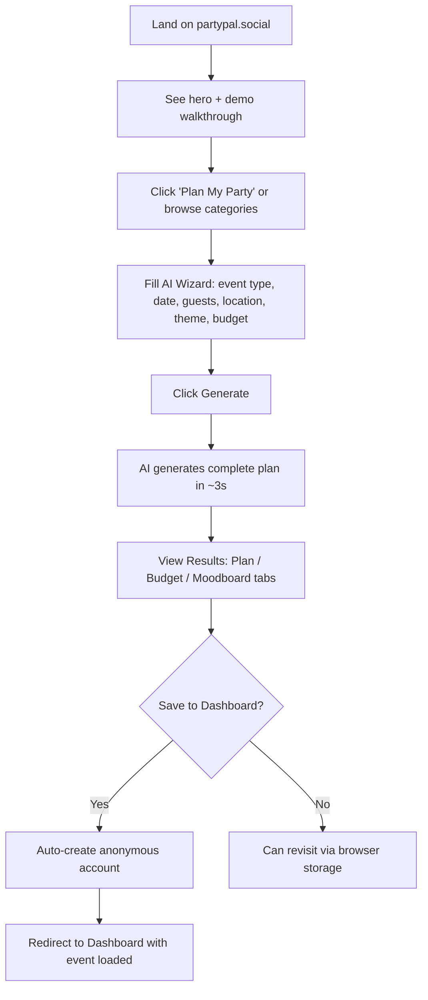
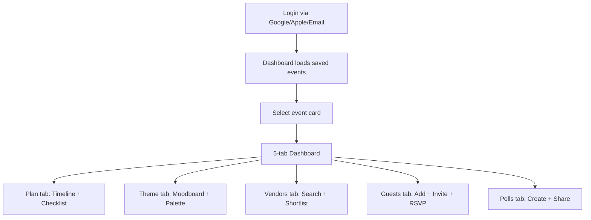
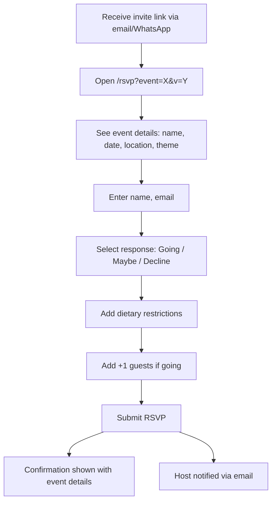

# PartyPal — Functional Design

> How the product works from the user's perspective.

---

## 1. User Journeys

### Journey 1: First-Time Visitor → Plan Generated

### Journey 2: Returning User → Manage Event

### Journey 3: Guest → RSVP Flow

---

## 2. Feature Flows

### 2.1 AI Plan Generation

**Inputs:**
| Field | Type | Required | Options |
|---|---|---|---|
| Event Type | Select | ✅ | Birthday, Wedding, Corporate, Holiday, Game Day, Graduation, Baby Shower, Retirement |
| Date | Date picker | ❌ | Any future date |
| Guest Count | Text | ✅ | e.g., "50 guests" |
| Location | Autocomplete | ✅ | Google Places Autocomplete |
| Theme | Text | ❌ | e.g., "Tropical Vibes" |
| Budget | Text | ❌ | e.g., "$2,000" — AI estimates if omitted |

**Output (JSON):**
- `summary` — 1-2 sentence event overview
- `timeline[]` — Milestone tasks with time periods, categories, priorities
- `checklist[]` — Actionable items with categories, mapped to timeline
- `budget.total` — Dollar amount (estimated if not provided)
- `budget.breakdown[]` — Category, amount, percentage, color
- `tips[]` — Actionable planning tips
- `moodboard` — Palette, keywords, vibe, decor ideas, tablescape, lighting, music

**Refinement Flow:**
1. User enters natural language instruction (e.g., "Make it more formal" or "Add a photo booth")
2. Existing timeline sent to Gemini with refinement request
3. AI returns updated timeline preserving unchanged items
4. Dashboard updates in-place

### 2.2 Vendor Discovery

**Flow:**
1. User selects category (Venue, Baker, Decor, etc.)
2. System detects user location via browser geolocation or manual entry
3. API calls Google Places New with category-specific search queries
4. Results filtered by relevant place types (relevance matching)
5. Each vendor enriched with: match score, badge, photos, ratings, price level
6. User can shortlist vendors → saved to event + Firestore
7. Shortlisted vendors appear in Dashboard "Vendors" tab

**Badges:**
| Badge | Criteria |
|---|---|
| 🏅 Top Pick | Rating ≥ 4.8 AND reviews ≥ 50 |
| ⭐ Popular | Rating ≥ 4.5 AND reviews ≥ 25 |
| ✅ Trusted | Rating ≥ 4.0 AND reviews ≥ 10 |

### 2.3 Guest Management

**Capabilities:**
- **Add individually:** Name, email, status, dietary
- **Bulk import:** Paste comma/newline-separated list
- **Status tracking:** Visual counts for going/maybe/declined/pending
- **Dietary summary:** Aggregated dietary requirements across all guests
- **AI invites:** Generate invitation text, copy/share, or email
- **RSVP link:** Versioned links (`v=<timestamp>`) for each published invite
- **Email invites:** Send styled HTML invitations with Resend
- **WhatsApp sharing:** Pre-formatted message with RSVP link
- **Guest notifications:** Bulk email when event details change

### 2.4 Polls

**Poll Types:**
| Type | Question | Example Options |
|---|---|---|
| Best Date | "Which date works best?" | Saturday Mar 15, Friday Mar 21 |
| Venue | "Which venue do you prefer?" | The Loft, Skyline Center |
| Theme | "Pick your favorite theme" | Tropical, Vintage, Neon |
| Food | "What food should we serve?" | BBQ, Italian, Mexican |
| Activity | "Which activity sounds fun?" | Karaoke, Trivia, Dance |
| Start Time | "What time works best?" | 2 PM, 5 PM, 7 PM |
| Custom | User-defined question | User-defined options |

**Sharing:** Generates sharable link `/poll?id=<pollId>` → Anyone can vote → Results visible to creator

### 2.5 Collaboration

**Flow:**
1. Host enters collaborator name, email, and role
2. System sends styled HTML email with accept link
3. Collaborator clicks link → `/collaborate?event=<id>&token=<token>`
4. Collaborator logs in or creates account
5. Event appears in collaborator's "My Events" dashboard
6. Host can assign checklist/timeline tasks to collaborators
7. Collaborators see assigned tasks highlighted

---

## 3. Data Persistence Model

### Local Storage (Client)
- Current event data (`partypal_planData`)
- Guest list per event
- Shortlisted vendors
- AI memory/preferences
- Analytics user ID

### Firestore (Cloud)
| Collection | Documents | Fields |
|---|---|---|
| `events` | Per event | Full plan data, collaborators, vendors, guests |
| `polls` | Per poll | Question, options, votes, eventId, creatorId |
| `users` | Per user | Profile, settings, AI memory |
| `analytics` | Per batch | Event array, timestamp |
| `rate_limits` | Per user/day | Call counts, last reset |
| `bugs` | Per report | Category, description, page, status, reporter info, timestamp |
| `api_logs` | Per call | Endpoint, service, timestamp, userId |

---

## 4. Admin Dashboard Flow

### 3.1 Access Control
- Admin navigates to `/admin`
- Firebase Auth checks if user email is in `ADMIN_EMAILS` whitelist (sourced from `SITE_EMAILS.admin`)
- Non-admin users see "Access Denied" with redirect to home/login
- All admin API calls include `Authorization: Bearer <idToken>` header

### 3.2 Dashboard Sections

**Executive Summary:**
- KPI cards: Page Views, Sessions, Registered Users, Sign Ups, Plans Generated, Vendor Searches, RSVPs, Errors
- Gemini AI Calls and Places API Calls with cost estimates (from `/api/admin/usage`)
- Configurable time period: 7, 14, 30, or 90 days

**User Drill-Down:**
- Collapsible section, fetched on-demand from `/api/admin/users`
- Searchable by name/email, sortable by Last Active, Most Sessions, Most Page Views, Name, Newest
- Per-user expandable detail: sign-up method, total time on site, join date, top pages visited, 30-day activity heatmap (GitHub-style), recent activity feed (last 10 events)
- User badges: ADMIN (gold), TEST (gray)

**Bug Report Management:**
- Fetched from `/api/bugs` on load
- Status workflow: 🔴 New → 🟡 Reviewed → 🟢 Fixed
- Status updates via `PATCH /api/bugs` with bug ID and new status
- Table columns: Status, Category (bug/feature/experience/tab/suggestion), Description, Page, Reporter, When, Action

**Health & Alerts:**
- Dynamic alert generation based on current data:
  - Churn spike: any deletions in period → warning/caution based on churn rate
  - Error rate: >1% of total events → caution alert
  - API cost: >$10/month estimated → warning; >$25 → caution
  - Low engagement: <2 sessions per registered user → warning
  - All clear: green "all systems healthy" when no alerts triggered

**Growth Accounting:**
- Net Growth (sign-ups minus deletions), Retention Rate, Events/Session, Plans/User, Error Rate, Activation Rate (Sign Up → Plan conversion)

**User Lifecycle & Churn:**
- Period deletions, churn rate, avg tenure before deletion, avg events before deletion
- Deletion reason breakdown with labeled categories (Not useful, Privacy, Another tool, Too complicated, Just testing, Other, Not specified)
- 14-day deletion timeline chart
- Churned user profiles table: name, email, tenure, events, sessions, reason, deletion time

### 3.3 Data Sources

| Admin Section | API Endpoint | Auth |
|---|---|---|
| KPIs, Traffic, Funnel, Events, Errors, Activity, Churn | `GET /api/analytics?q=dashboard&days=N` | Bearer token |
| AI Usage, Rate Limits, API Metrics | `GET /api/admin/usage` | Bearer token |
| Poll Analytics | `GET /api/polls?stats=true` | None |
| Bug Reports | `GET /api/bugs` | None |
| Bug Status Update | `PATCH /api/bugs` | None |
| User Drill-Down | `GET /api/admin/users` | Bearer token |

---

## 5. Responsive Design Breakpoints

| Viewport | Layout |
|---|---|
| Desktop (>900px) | Full sidebar navigation, multi-column dashboard |
| Tablet (600–900px) | Collapsed nav, 2-column grids |
| Mobile (<600px) | Hamburger menu, single column, stacked tabs |

---

## 6. Error States & Edge Cases

| Scenario | Handling |
|---|---|
| AI generation fails | Error toast with retry prompt |
| Rate limit exceeded | 429 response with "try again tomorrow" message |
| No vendors found | Fallback message suggesting broader search |
| Location denied | Manual location entry fallback |
| Offline access | Cached event data from localStorage |
| Duplicate guest | Prevented by email deduplication |
| Invalid RSVP link | Error page with explanation |
| Session expired | Auto-redirect to login |
