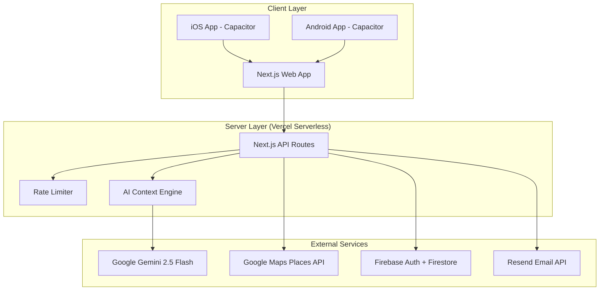
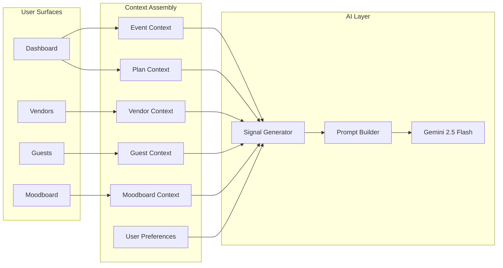
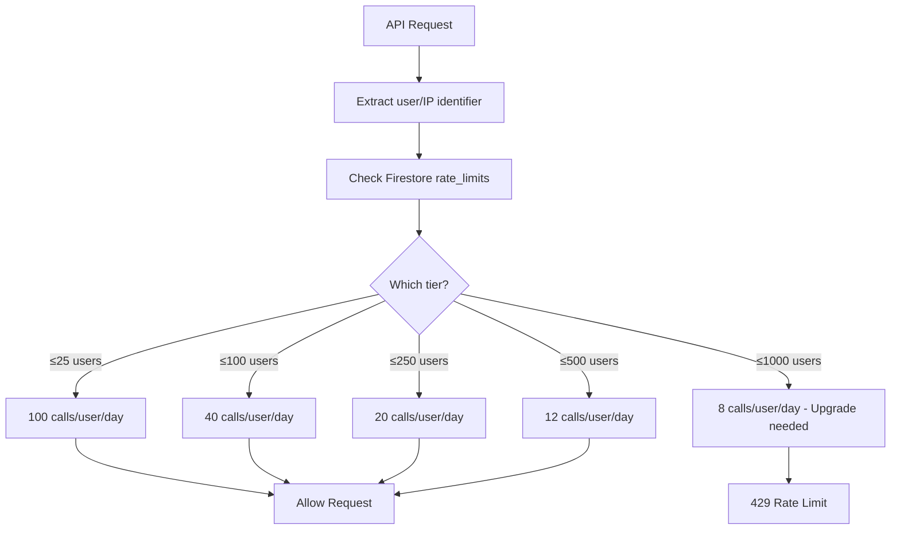
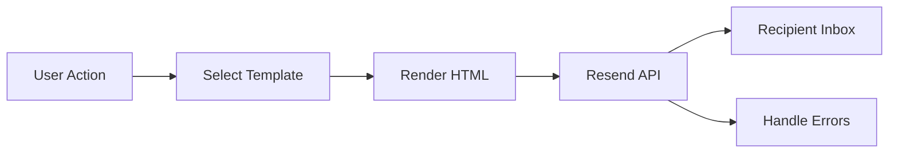
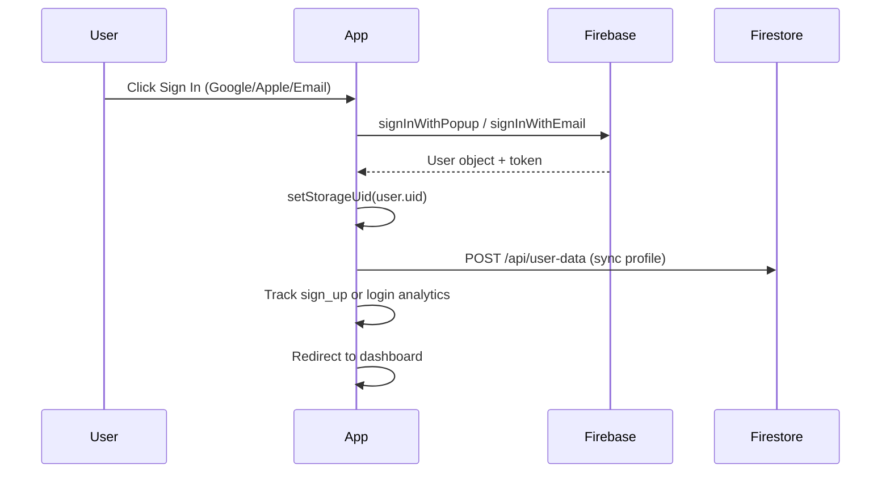
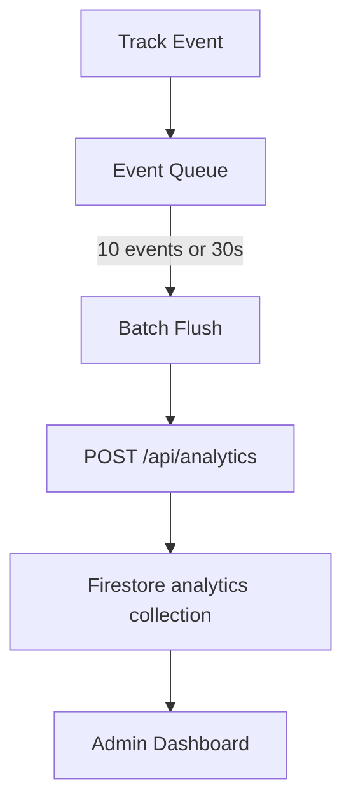

# PartyPal — Technical Design

> Architecture, data flows, AI integration, and infrastructure details.

---

## 1. System Architecture



---

## 2. Core Architecture Patterns

### 2.1 Next.js App Router
- **Client components** (`'use client'`) for all interactive pages
- **Server-side API routes** for external API calls (keys protected)
- **Suspense boundaries** for search params usage
- **CSS Modules** for component-level styling
- **Global CSS** for theme tokens, nav, toast, responsive overrides

### 2.2 Cross-Portal AI Context Engine

The most sophisticated piece of architecture — a system that gives the AI full awareness of the user's situation across all surfaces.



**Context Types:**

| Context | Data Points |
|---|---|
| `EventContext` | Event type, date, days until, guests, location, budget |
| `GuestContext` | Total guests, confirmed, dietary restrictions, dietary summary |
| `VendorContext` | Shortlisted vendors, booked/unbooked categories, budget spent/remaining |
| `PlanContext` | Has timeline, completed/total tasks, progress %, overdue/upcoming tasks |
| `MoodboardContext` | Palette, vibe, decor style, music genre |
| `UserPreferences` | Planning style, budget tendency, tone preference, favorite categories |

**Signal Generation:**
The `generateSignals()` function analyzes cross-context relationships to produce smart observations:
- "Guest count exceeds venue capacity" → suggest larger venue
- "Budget nearly depleted but no photographer booked" → prioritize
- "Event is in 3 days but checklist is only 20% done" → alert

### 2.3 AI Memory & Learning System

```mermaid
flowchart TD
    UserAction[User Action] --> Signal[Interaction Signal]
    Signal --> Processor[Record Interaction]
    Processor --> Prefs[Updated Preferences]
    Prefs --> Local[localStorage]
    Prefs --> Cloud[Firestore /users/{uid}]
    Cloud --> Merge[Cloud ↔ Local Merge]
    Merge --> Context[Inject into AI Context]
```

**Interaction Signals:**
| Signal | What It Learns |
|---|---|
| `plan_generated` | Past event types |
| `plan_refined` | Tone preference, refinement patterns |
| `vendor_shortlisted` | Favorite categories |
| `budget_adjusted` | Budget tendency (frugal/moderate/lavish) |
| `invite_style_chosen` | Tone preference |
| `theme_selected` | Planning style |
| `moodboard_generated` | Planning style (detailed) |
| `guest_added` | Data completeness habits |
| `checklist_completed` | Task category engagement |

### 2.4 Dynamic Rate Limiter



**Configuration (Gemini Paid Tier 1):**
| Limit | Value |
|---|---|
| Daily Request Budget | 1,500 RPD |
| Requests Per Minute | 300 RPM |
| Tokens Per Minute | 1,000,000 TPM |

---

## 3. API Route Architecture

### 3.1 AI Endpoints (Gemini)

Each AI endpoint follows the same pattern:

```typescript
// 1. Rate limit check
const rateCheck = await checkRateLimit(identifier, endpoint)
if (!rateCheck.allowed) return 429

// 2. Build cross-portal context
const contextBlock = hasContext(body) ? assembleContext(body, surface) : ''

// 3. Construct prompt with context injection
const prompt = `${contextBlock}[task-specific prompt]...`

// 4. Call Gemini 2.5 Flash
const model = genAI.getGenerativeModel({ model: 'gemini-2.5-flash' })
const result = await model.generateContent(prompt)

// 5. Parse JSON response
const cleaned = text.replace(/```json\n?/g, '').replace(/```\n?/g, '').trim()
const data = JSON.parse(cleaned)

// 6. Log API usage (fire-and-forget)
logApiCall(endpoint, 'gemini', identifier)

return NextResponse.json(data)
```

### 3.2 Vendor Search (Google Places)

```
POST /api/vendors
  ↓
Category → CATEGORY_MAP → search query + relevant types
  ↓
Google Places New: POST /v1/places:searchText
  Headers: X-Goog-Api-Key, X-Goog-FieldMask
  ↓
Filter by relevantTypes (post-search filtering)
  ↓
Enrich: match score, badge, photo URLs, price mapping
  ↓
Cache: 5-min in-memory TTL (Map<string, {data, ts}>)
  ↓
Return: Vendor[] with id, name, category, rating, photos, etc.
```

### 3.3 Email Pipeline



**Templates System:**
- Branded color palette (teal, coral, yellow, navy)
- Responsive HTML with `baseLayout()` → `headerBlock()` → `bodyWrap()` → `infoBox()`
- 9 templates covering full email lifecycle

---

## 4. State Management

### Client-Side State Flow

```
User Action
  ↓
React useState/useEffect
  ↓
localStorage (immediate persistence)
  ↓
Firestore sync (fire-and-forget)
  ↓
On next load: Firestore → localStorage merge
```

**Key Design Decisions:**
- **No state management library** (Redux, Zustand) — React hooks are sufficient
- **localStorage-first** for instant UX, cloud sync for cross-device
- **Fire-and-forget** Firestore writes — non-blocking, error-swallowed
- **Firestore wins** on merge conflicts (higher interaction count wins for AI memory)

### Storage Abstraction (`userStorage.ts`)
```typescript
userGet(key)          // localStorage.getItem (with uid prefix if logged in)
userSetJSON(key, val) // JSON.stringify → localStorage
userGetJSON(key)      // localStorage → JSON.parse
setStorageUid(uid)    // Set active user prefix
```

---

## 5. Authentication Flow



**Auth States:**
| State | Behavior |
|---|---|
| Anonymous | Can use all features, data in localStorage only |
| Authenticated | Data synced to Firestore, cross-device access |
| Admin | Analytics dashboard visible, admin API access |

---

## 6. Analytics Architecture



**Tracked Events:**
`page_view`, `page_exit`, `sign_up`, `login`, `plan_generated`, `plan_refined`, `vendor_search`, `vendor_shortlisted`, `invite_sent`, `rsvp_submitted`, `event_created`, `notification_sent`, `feature_used`, `error`

**Error Tracking:**
- Global `window.onerror` handler
- Unhandled promise rejection handler
- `beforeunload` + `visibilitychange` flush

---

## 7. Security Model

| Layer | Implementation |
|---|---|
| **API Keys** | Server-side only (`process.env`), never exposed to client |
| **Auth** | Firebase Auth tokens, server-side verification via Admin SDK |
| **Admin** | Email whitelist in `admin-auth.ts` and `Nav.tsx` |
| **Rate Limiting** | IP + UID based, Firestore-backed daily counters |
| **Input Validation** | Required field checks on all API routes |
| **CORS** | Default Next.js CORS (same-origin API routes) |
| **Data Privacy** | Account deletion cascades through events, analytics, user data |
| **Env Variables** | `.env.local` in `.gitignore`, Vercel env vars for production |

---

## 8. Performance Optimizations

| Optimization | Impact |
|---|---|
| **Vendor caching** (5-min TTL) | Eliminates repeat Google Places API calls |
| **Analytics batching** (10 events / 30s) | Reduces API calls by ~90% |
| **Fire-and-forget writes** | Non-blocking Firestore syncs |
| **Suspense boundaries** | Prevents hydration mismatches with search params |
| **CSS Modules** | Scoped styles, no runtime CSS-in-JS cost |
| **Static generation** | Privacy, contact pages pre-rendered |
| **Image optimization** | Vendor photos served at 400px max width |
