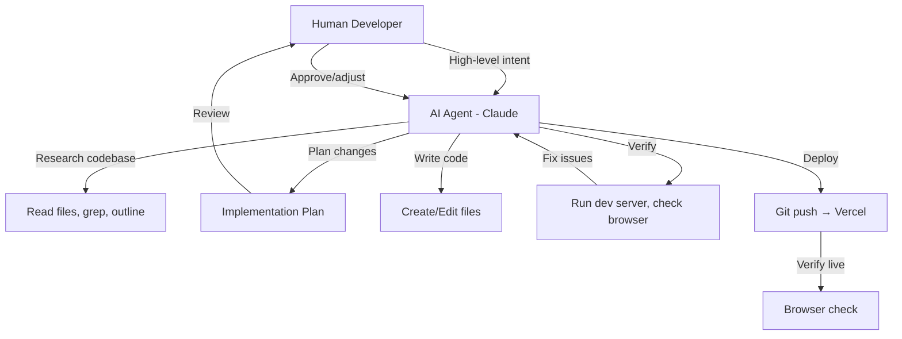

# PartyPal — Agentic Workflow

> How AI agents (Claude/Gemini) were used to build PartyPal from scratch.

---

## 1. Overview

PartyPal was built entirely through **agentic AI pair programming** — a human directing an AI coding assistant that reads, writes, debugs, deploys, and iterates on the full codebase. This document captures the workflow, patterns, and lessons from building a production app with AI agents.

---

## 2. Development Model



### Human Role (Product Owner)
- Define features and priorities
- Review implementation plans
- Accept or redirect design decisions
- Test live deployments
- Provide API keys and credentials
- Make business decisions (domain, accounts, store listings)

### Agent Role (Full-Stack Developer)
- Research existing codebase state
- Design technical architecture
- Write all code (React, TypeScript, CSS, API routes)
- Debug issues in real-time
- Run terminal commands (dev server, git, npm)
- Deploy to production (Vercel)
- Generate assets (screenshots, store listings)

---

## 3. Conversation-Based Development

### Session Structure
Each conversation typically follows this pattern:

| Phase | Duration | Activities |
|---|---|---|
| **1. Context** | 2–5 min | User describes goal, agent reads relevant files |
| **2. Plan** | 2–5 min | Agent proposes approach, user approves |
| **3. Execute** | 10–40 min | Agent writes code, creates/edits files |
| **4. Verify** | 5–10 min | Agent checks browser, runs build, fixes issues |
| **5. Deploy** | 2–5 min | Git commit, push, Vercel deploy, verify live |

### Conversation Log (Major Sessions)

| Session | Features Built |
|---|---|
| Initial Build | Next.js scaffold, landing page, AI wizard, plan generation |
| Vendor Marketplace | Google Places integration, category search, shortlisting |
| Guest Management | Guest CRUD, RSVP tracking, AI invite generation |
| Dashboard | Multi-tab dashboard, checklist, timeline, budget tracker |
| Moodboard & Theme | AI moodboard generation, color palette, decor ideas |
| Settings & Auth | Firebase Auth (Google/Apple/Email), settings page |
| Polls & Collaboration | Poll system, collaborator invites, task assignment |
| Email System | 9 HTML templates, Resend integration, notification pipeline |
| AI Intelligence | Cross-portal context, AI memory, preference learning |
| Analytics & Admin | Client-side tracking, admin dashboard, KPIs |
| Mobile Apps | Capacitor setup, iOS/Android configs, store listings |
| Rate Limiting | Dynamic rate limiter, tiered scaling, API usage tracking |
| Bug Fixes & Polish | Vendor sync, shortlist fixes, location search refactoring |
| Deployment | GitHub, Vercel, domain setup, env variables |

---

## 4. Agentic Patterns Used

### Pattern 1: Research-First Development
```
Agent: "Let me first understand the existing codebase structure..."
  → list_dir, view_file_outline, grep_search
  → "I see the dashboard uses X pattern, the API uses Y..."
  → "Here's my plan for adding Feature Z..."
```

**Why it works:** The agent never makes assumptions. It reads the actual code before proposing changes, leading to consistent patterns and fewer conflicts.

### Pattern 2: Plan → Approve → Execute
```
Agent: Creates implementation_plan.md with:
  - Problem description
  - Proposed changes (file-by-file)
  - User review items
  - Verification plan
User: "Looks good" or "Change X"
Agent: Executes the approved plan
```

**Why it works:** Prevents wasted work on wrong approaches. The human stays in control of design decisions.

### Pattern 3: Multi-File Coordination
```
Agent: Identifies related files that need updating
  → Edit API route + component + types + styles simultaneously
  → Ensure type consistency across boundaries
```

**Why it works:** AI agents can hold the full context of interconnected changes and make them atomically.

### Pattern 4: Browser-Verified Development
```
Agent: Makes code changes
  → Checks running dev server
  → Opens browser to verify UI
  → Takes screenshots for walkthrough
  → Fixes visual issues in real-time
```

**Why it works:** The agent doesn't just write code — it visually verifies the output, catching CSS issues, layout problems, and UX gaps.

### Pattern 5: Iterative Refinement
```
User: "Make the cards look more premium"
Agent: Reads current CSS → Identifies improvement areas
  → Adds gradients, shadows, animations
  → Browser-checks result
  → Refines until premium feel achieved
```

**Why it works:** Subjective design goals are achieved through rapid iteration cycles (agent writes → checks → adjusts).

---

## 5. Key Challenges & Solutions

| Challenge | Solution |
|---|---|
| **Context loss between conversations** | Agent re-reads relevant files at start of each session |
| **Large file coordination** | Agent outlines files first, then targets specific sections |
| **API key management** | User provides keys, agent configures `.env.local` and Vercel |
| **Production bugs** | Agent checks live site, reads server logs, hotfixes |
| **Design subjectivity** | Rapid UI iterations until user approves visual result |
| **Mobile compatibility** | Capacitor hybrid approach avoids separate mobile codebase |

---

## 6. Productivity Metrics

| Metric | Estimate |
|---|---|
| **Total conversations** | ~20 major sessions |
| **Total code written** | ~15,000+ lines of TypeScript/TSX/CSS |
| **Files created** | ~50+ source files |
| **API integrations** | 4 external services (Gemini, Google Maps, Firebase, Resend) |
| **Time to MVP** | ~3-4 days of focused sessions |
| **Time to production** | ~1-2 weeks total |
| **Deployment frequency** | Multiple deploys per session |

---

## 7. Workflow Recommendations

### For Future AI-Assisted Projects:

1. **Start with the landing page** — establishes design language, color palette, typography
2. **Build API routes before UI** — data shapes drive component design
3. **Use implementation plans** — prevents scope creep and miscommunication
4. **Deploy early and often** — catch production-only issues fast
5. **Maintain a task.md** — keeps agent and human aligned on progress
6. **Leverage AI for boring work** — email templates, CSS polish, data seeding
7. **Human decides, AI executes** — the human should drive product decisions
8. **Re-read code at session start** — agents lose context between conversations
