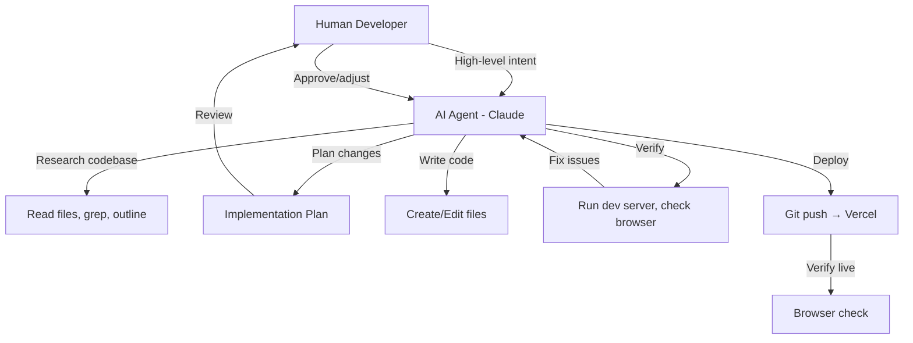

# PartyPal — Agentic Workflow

> How AI agents (Claude/Gemini) were used to build PartyPal from scratch.

---

## 1. Overview

PartyPal was built entirely through **agentic AI pair programming** — a human directing an AI coding assistant that reads, writes, debugs, deploys, and iterates on the full codebase. This document captures the workflow, patterns, and lessons from building a production app with AI agents.

---

## 2. Development Model



### Human Role (Product Owner)
- Define features and priorities
- Review implementation plans
- Accept or redirect design decisions
- Test live deployments
- Provide API keys and credentials
- Make business decisions (domain, accounts, store listings)

### Agent Role (Full-Stack Developer)
- Research existing codebase state
- Design technical architecture
- Write all code (React, TypeScript, CSS, API routes)
- Debug issues in real-time
- Run terminal commands (dev server, git, npm)
- Deploy to production (Vercel)
- Generate assets (screenshots, store listings)

---

## 3. Conversation-Based Development

### Session Structure
Each conversation typically follows this pattern:

| Phase | Duration | Activities |
|---|---|---|
| **1. Context** | 2–5 min | User describes goal, agent reads relevant files |
| **2. Plan** | 2–5 min | Agent proposes approach, user approves |
| **3. Execute** | 10–40 min | Agent writes code, creates/edits files |
| **4. Verify** | 5–10 min | Agent checks browser, runs build, fixes issues |
| **5. Deploy** | 2–5 min | Git commit, push, Vercel deploy, verify live |

### Conversation Log (Major Sessions)

| Session | Features Built |
|---|---|
| Initial Build | Next.js scaffold, landing page, AI wizard, plan generation |
| Vendor Marketplace | Google Places integration, category search, shortlisting |
| Guest Management | Guest CRUD, RSVP tracking, AI invite generation |
| Dashboard | Multi-tab dashboard, checklist, timeline, budget tracker |
| Moodboard & Theme | AI moodboard generation, color palette, decor ideas |
| Settings & Auth | Firebase Auth (Google/Apple/Email), settings page |
| Polls & Collaboration | Poll system, collaborator invites, task assignment |
| Email System | 9 HTML templates, Resend integration, notification pipeline |
| AI Intelligence | Cross-portal context, AI memory, preference learning |
| Analytics & Admin | Client-side tracking, admin dashboard, KPIs |
| Mobile Apps | Capacitor setup, iOS/Android configs, store listings |
| Rate Limiting | Dynamic rate limiter, tiered scaling, API usage tracking |
| Bug Fixes & Polish | Vendor sync, shortlist fixes, location search refactoring |
| Deployment | GitHub, Vercel, domain setup, env variables |

---

## 4. Agentic Patterns Used

### Pattern 1: Research-First Development
```
Agent: "Let me first understand the existing codebase structure..."
  → list_dir, view_file_outline, grep_search
  → "I see the dashboard uses X pattern, the API uses Y..."
  → "Here's my plan for adding Feature Z..."
```

**Why it works:** The agent never makes assumptions. It reads the actual code before proposing changes, leading to consistent patterns and fewer conflicts.

### Pattern 2: Plan → Approve → Execute
```
Agent: Creates implementation_plan.md with:
  - Problem description
  - Proposed changes (file-by-file)
  - User review items
  - Verification plan
User: "Looks good" or "Change X"
Agent: Executes the approved plan
```

**Why it works:** Prevents wasted work on wrong approaches. The human stays in control of design decisions.

### Pattern 3: Multi-File Coordination
```
Agent: Identifies related files that need updating
  → Edit API route + component + types + styles simultaneously
  → Ensure type consistency across boundaries
```

**Why it works:** AI agents can hold the full context of interconnected changes and make them atomically.

### Pattern 4: Browser-Verified Development
```
Agent: Makes code changes
  → Checks running dev server
  → Opens browser to verify UI
  → Takes screenshots for walkthrough
  → Fixes visual issues in real-time
```

**Why it works:** The agent doesn't just write code — it visually verifies the output, catching CSS issues, layout problems, and UX gaps.

### Pattern 5: Iterative Refinement
```
User: "Make the cards look more premium"
Agent: Reads current CSS → Identifies improvement areas
  → Adds gradients, shadows, animations
  → Browser-checks result
  → Refines until premium feel achieved
```

**Why it works:** Subjective design goals are achieved through rapid iteration cycles (agent writes → checks → adjusts).

---

## 5. Maintenance Pipeline — 7-Agent System

Beyond initial development, PartyPal uses a **7-agent pipeline** for ongoing maintenance, bug fixes, and feature delivery. The pipeline enforces two human gates and runs across three execution modes: CLI, CI/CD, and a production web dashboard.

### Pipeline Flow

```
Bug/Feature Intake → Triage/Prioritize → [HUMAN APPROVAL] → Dev Agent → Code Review
→ [HUMAN REVIEW] → Test Agent → Sandbox Deploy → Shiproom → [HUMAN SHIPS]
```

### The 7 Agents

| # | Agent | Prompt File | Purpose |
|---|-------|-------------|---------|
| 1 | **Bug Triage** | `.agents/prompts/bug-triage.md` | Classifies bugs by severity (P0–P3), maps to module, hypothesizes root cause, outputs structured JSON ticket |
| 2 | **Feature Prioritize** | `.agents/prompts/feature-prioritize.md` | Scores features on a weighted rubric (Impact ×3, Revenue ×2, Strategic ×2, Feasibility ×1, minus Effort), recommends BUILD/DEFER/REJECT |
| 3 | **Dev Agent** | `.agents/prompts/dev-agent.md` | Writes production-ready code following all PartyPal conventions, includes a security checklist |
| 4 | **Code Review** | `.agents/prompts/code-review.md` | Reviews diffs with a multi-tier checklist: Security (BLOCKING), Convention (WARNING), Logic (WARNING), Performance (INFO), Mobile (INFO). Outputs PASS/FAIL/PASS_WITH_WARNINGS |
| 5 | **Test Agent** | `.agents/prompts/test-agent.md` | Generates and runs tests using Vitest. Defines 10 golden test cases that must always pass. Includes Firestore and NextRequest mock patterns |
| 6 | **Sandbox Deploy** | `.agents/prompts/sandbox-deploy.md` | Deploys to Vercel preview, runs smoke tests against 9 endpoints, reports health as HEALTHY/DEGRADED/DOWN |
| 7 | **Shiproom** | `.agents/prompts/shiproom.md` | Final gate agent. Synthesizes all pipeline outputs into a SHIP/HOLD/REJECT decision brief with risk assessment |

### Three Execution Modes

**CLI Mode** (`npm run agent:*`)

Shell scripts invoke Claude Code locally with structured system prompts. The full pipeline (`npm run agent:pipeline` / `scripts/pipeline.sh`) is interactive with terminal-based human gates and writes reports to `.agents/reports/`.

| Command | What It Does |
|---------|-------------|
| `npm run agent:triage` | Feed a bug report to the triage agent |
| `npm run agent:prioritize` | Feed a feature request to the prioritize agent |
| `npm run agent:dev` | Launch Claude interactively with the dev-agent prompt |
| `npm run agent:review` | Capture `git diff`, run code review agent |
| `npm run agent:test` | Run golden tests (blocking), then full suite |
| `npm run agent:sandbox` | Build, deploy to Vercel preview, smoke-test endpoints |
| `npm run agent:shiproom` | Gather reports, produce SHIP/HOLD/REJECT recommendation |
| `npm run agent:pipeline` | Run the full pipeline end-to-end with human gates |

**CI/CD Mode** (GitHub Actions — `.github/workflows/pipeline.yml`)

Automated on every push/PR. Runs 5 jobs: lint, golden tests, full test suite with coverage, build verification, and security scanning (hardcoded secrets, `eval()`, `dangerouslySetInnerHTML`, `console.log` counts). No AI agents in this path — purely deterministic.

**Web Dashboard Mode** (`/admin/pipeline`)

Production admin UI backed by Firestore. Features:
- 5 tabs: Overview (KPIs + pipeline flow), Tickets (CRUD + AI triage), Agents (enable/disable + auto-run toggles), Tests (golden suite display), Runs (per-stage tracking)
- AI triage and code review executed via Gemini 2.5 Flash directly from the browser (`lib/pipeline-ai.ts`)
- Enforced stage ordering with auto-advance logic
- Email notifications at every stage transition (`lib/pipeline-notify.ts`)
- "Copy for Claude Code" button that generates structured prompts for manual fixes
- Human gate toggle configuration per stage

### Pipeline Data Model (Firestore)

| Collection | Purpose |
|------------|---------|
| `pipeline_runs` | Pipeline execution state with per-stage status |
| `pipeline_tickets` | Bug/feature tickets with triage results |
| `pipeline_config` | Agent enable/disable and gate settings |

### Golden Test Suite

Located in `tests/golden/critical-paths.test.ts` — 6 suites, 25 tests that must never break:

1. **Event CRUD** — GET/POST/DELETE validation, ownership checks
2. **Auth Guards** — PATCH ownership enforcement, missing action, nonexistent event
3. **Poll Lifecycle** — Create/vote/read/delete validation
4. **Rate Limiter** — Tier calculation for various user base sizes
5. **Email System** — Sender types, function exports
6. **Error Response Shapes** — All API routes return `{ error: string }` on failure

Golden tests block the pipeline at both the CLI level (`scripts/pre-push.sh` hook) and CI level (GitHub Actions).

### Inbox/Reports Convention

- `.agents/inbox/` — Drop `.md` files here as bug/feature tickets for processing
- `.agents/reports/` — Agent outputs: diffs, triage reports, test reports, deploy reports, shiproom briefs, and `audit.log` for gate approvals/rejections

---

## 6. Key Challenges & Solutions

| Challenge | Solution |
|---|---|
| **Context loss between conversations** | Agent re-reads relevant files at start of each session |
| **Large file coordination** | Agent outlines files first, then targets specific sections |
| **API key management** | User provides keys, agent configures `.env.local` and Vercel |
| **Production bugs** | Agent checks live site, reads server logs, hotfixes |
| **Design subjectivity** | Rapid UI iterations until user approves visual result |
| **Mobile compatibility** | Capacitor hybrid approach avoids separate mobile codebase |

---

## 7. Productivity Metrics

| Metric | Estimate |
|---|---|
| **Total conversations** | ~20 major sessions |
| **Total code written** | ~16,000+ lines of TypeScript/TSX/CSS |
| **Files created** | ~50+ source files |
| **API integrations** | 4 external services (Gemini, Google Maps, Firebase, Resend) |
| **Time to MVP** | ~3-4 days of focused sessions |
| **Time to production** | ~1-2 weeks total |
| **Deployment frequency** | Multiple deploys per session |

---

## 8. Workflow Recommendations

### For Future AI-Assisted Projects:

1. **Start with the landing page** — establishes design language, color palette, typography
2. **Build API routes before UI** — data shapes drive component design
3. **Use implementation plans** — prevents scope creep and miscommunication
4. **Deploy early and often** — catch production-only issues fast
5. **Maintain a task.md** — keeps agent and human aligned on progress
6. **Leverage AI for boring work** — email templates, CSS polish, data seeding
7. **Human decides, AI executes** — the human should drive product decisions
8. **Re-read code at session start** — agents lose context between conversations
